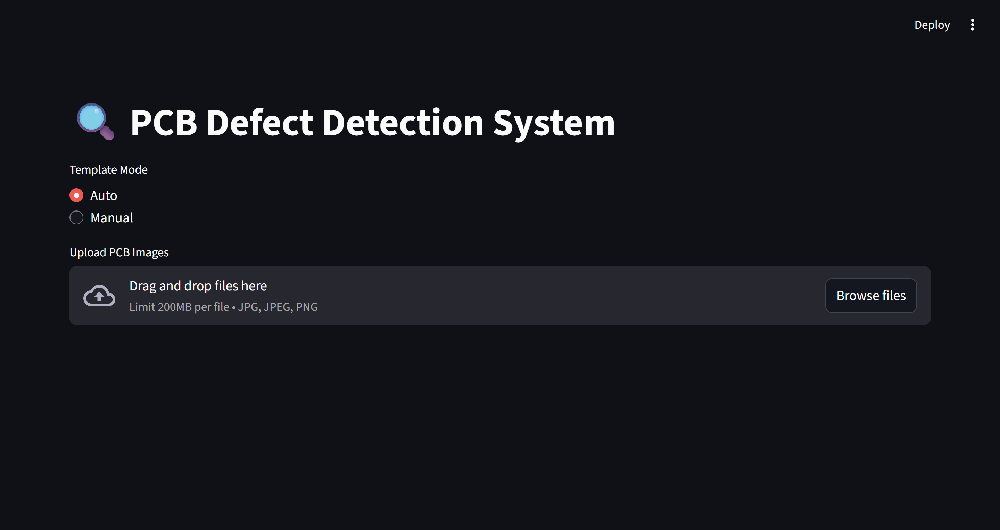
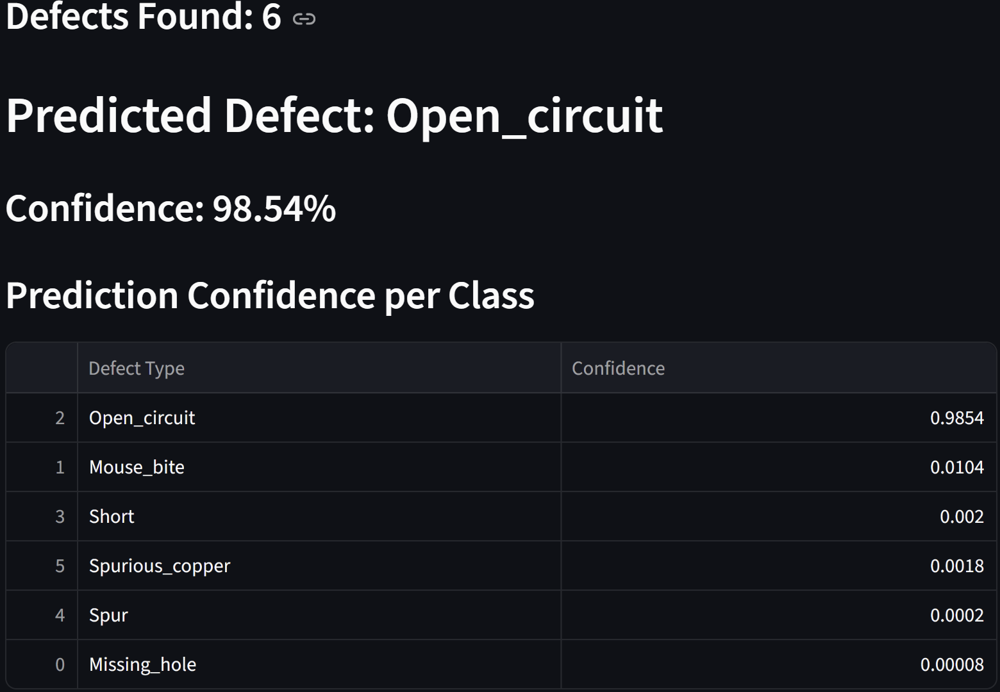
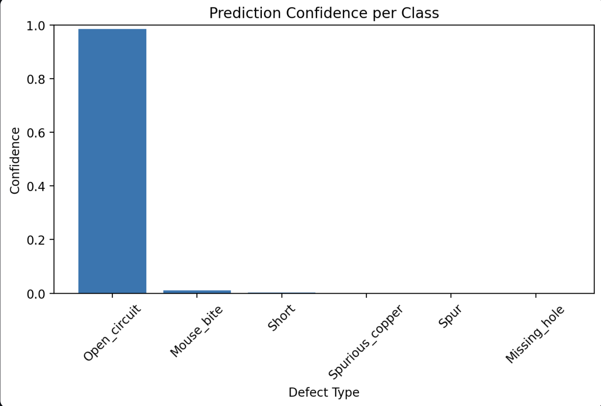

<p align="center">

</p>

<h1 align="center">🔍 Smart PCB Defect Detection & Classification</h1>

<p align="center">

AI Powered PCB Inspection using Deep Learning & Computer Vision

</p>

<p align="center">


</p>

---

# 📌 Overview

Smart PCB Defect Detection & Classification is an AI-powered computer vision application that automates Printed Circuit Board (PCB) inspection.

The system detects defects from uploaded PCB images and classifies them into predefined defect categories using a trained PyTorch deep learning model.

---

# 🚀 Features

✅ PCB Defect Detection

✅ PCB Defect Classification

✅ Automatic Template Matching

✅ Manual Template Selection

✅ Bounding Box Visualization

✅ Confidence Score

✅ Confidence Table

✅ Confidence Graph

✅ Upload Multiple PCB Images

---

# 🖼 Application Demo

## Home Page



---

## PCB Detection


---

## Prediction Result



---

## Confidence Graph



---

# 🧠 Supported Defects

| Defect |
|---------|
| Missing Hole |
| Mouse Bite |
| Open Circuit |
| Short |
| Spur |
| Spurious Copper |

---

# ⚙ Technology Stack

| Category | Technology |
|----------|------------|
| Language | Python |
| Framework | Flask |
| AI | PyTorch |
| Computer Vision | OpenCV |
| Frontend | Streamlit |
| Visualization | Matplotlib |
| Image Processing | Pillow |

---

# 🧠 AI Workflow

```text
Upload PCB Image
        │
        ▼
Image Preprocessing
        │
        ▼
Deep Learning Model
        │
        ▼
Defect Classification
        │
        ▼
Bounding Box Detection
        │
        ▼
Confidence Analysis
        │
        ▼
Prediction Result
```

---

# 📂 Project Structure

```text
Smart-PCB-defect-detection-and-classification

│
├── app.py
├── api.py
├── inference_backend.py
├── best_model.pth
├── class_names.json
│
├── sample/
├── Template/
│
├── images/
│      home.png
│      detection.png
│      result.png
│      chart.png
│
├── requirements.txt
└── README.md
```

---

# 📈 Example Prediction

| Item | Value |
|------|-------|
| Predicted Class | Open Circuit |
| Confidence | 98.54% |
| Defects Found | 6 |

---

# 💻 Installation

```bash
git clone https://github.com/kanhumishra/Smart-PCB-defect-detection-and-classification.git

cd Smart-PCB-defect-detection-and-classification

pip install -r requirements.txt

python app.py
```

---

# 🎯 Future Improvements

- Grad-CAM Visualization
- REST API
- Docker Support
- Cloud Deployment
- Live Webcam Detection
- Defect Localization
- Mobile App

---

# 👨‍💻 Author

Kanhu Charan Mishra

MCA Student | Data Analyst | AI Enthusiast

GitHub

https://github.com/kanhumishra

---

⭐ If you like this project, don't forget to star the repository.
